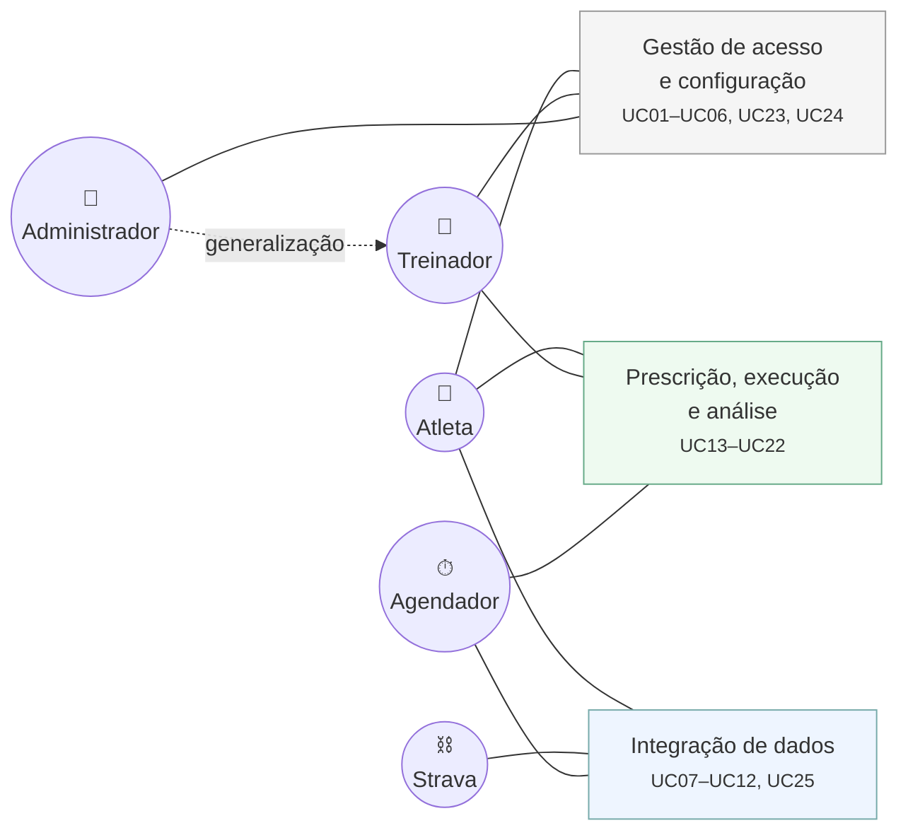
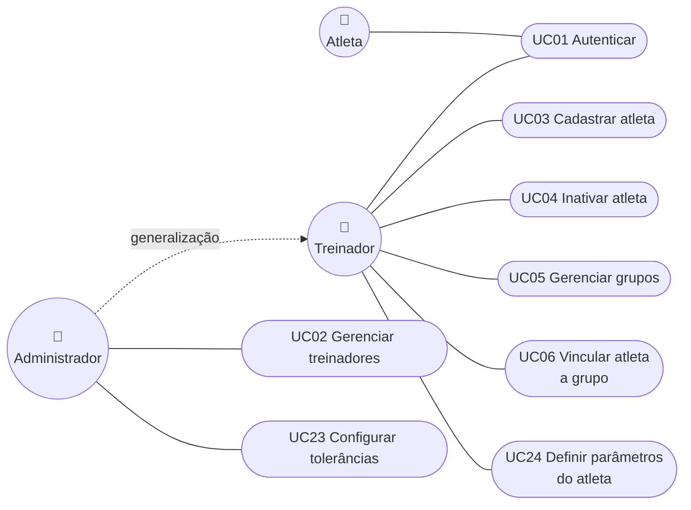
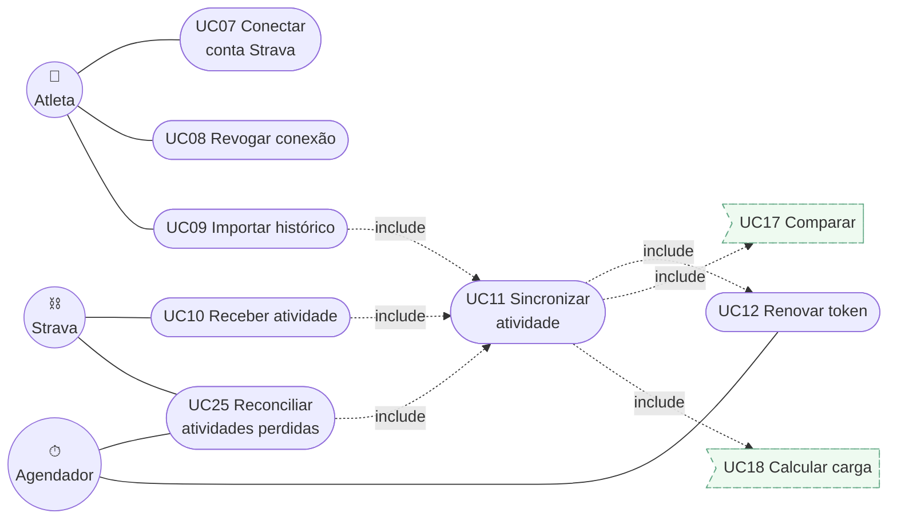
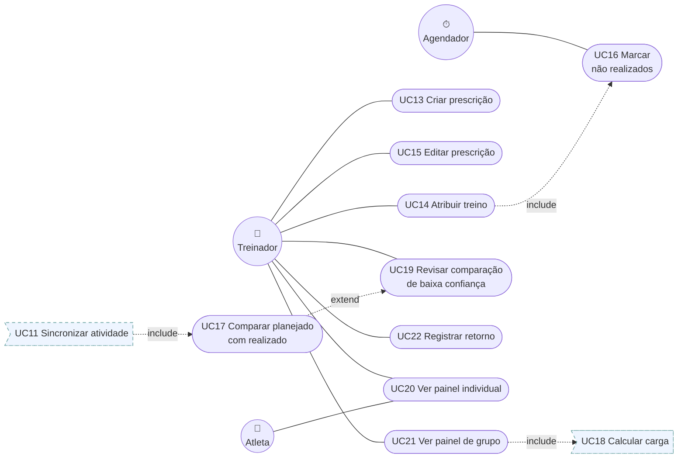
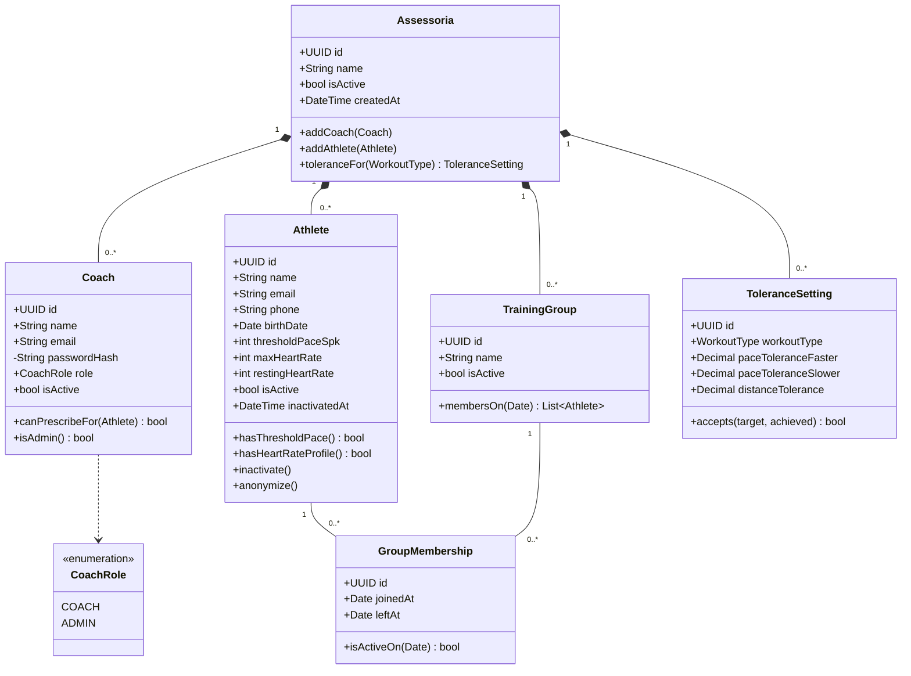
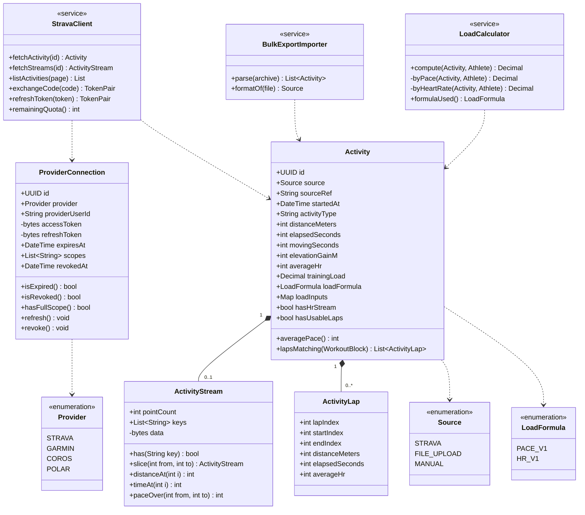
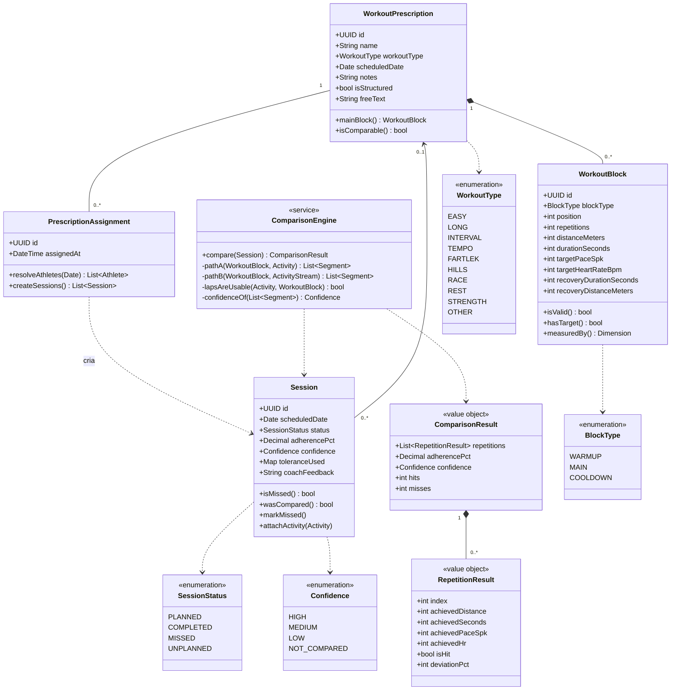

# Pulsar — Modelo de Casos de Uso e Diagrama de Classes

**Situação:** Rascunho para revisão
**Data:** 2026-08-25
**Escopo:** Produto mínimo viável conforme D6 — núcleo mais painel de grupo
**Deriva de:** [MODEL.md](MODEL.md), [PRESCRIPTION.md](PRESCRIPTION.md), [COMPARISON.md](COMPARISON.md)
**Idioma:** Português. Termos escritos por extenso, sem siglas. Nomes de classe e método em inglês, como é costume em código.

> Os diagramas estão em Mermaid e renderizam no Visual Studio Code, no GitHub e em qualquer visualizador de Markdown com suporte a Mermaid.

---

# PARTE I — MODELO DE CASOS DE USO

## 1. Atores

| Ator | Tipo | Descrição |
|---|---|---|
| **Atleta** | primário, humano | Corre, conecta a própria conta do Strava, consulta os próprios dados |
| **Treinador** | primário, humano | Prescreve treinos, acompanha atletas e grupos, dá retorno |
| **Administrador** | primário, humano | Treinador com poderes adicionais: gerencia treinadores e configurações da assessoria |
| **Strava** | secundário, sistema | Fornece atividades por API e avisos automáticos |
| **Agendador** | secundário, sistema | Ator temporal — representa a passagem do tempo. Dispara o que não tem quem dispare: marcação de treinos não realizados, reconciliação de atividades perdidas e renovação preventiva de token |

O **Administrador** herda todos os casos de uso do **Treinador**. É generalização, não papel separado.

### Por que o Agendador é um ator

Em UML, todo caso de uso precisa de alguém que o inicie. Alguns dos casos do Pulsar não são iniciados por pessoa nem por sistema externo — são iniciados por **uma data chegar**. O ator temporal é a forma canônica de representar isso.

Não é firula de notação. Ele existe porque o sistema precisa reagir a **não-eventos**, e não-evento não gera gatilho:

- O atleta **não** correu → o Strava não manda aviso nenhum. Sem o Agendador, a sessão fica `planned` para sempre, a aderência é calculada só sobre o que foi feito, e **dá perto de 100% para todo mundo, inclusive para quem faltou metade do mês**. A única métrica que justifica o produto estaria errada — e errada para cima, que é o pior tipo, porque parece plausível.
- O aviso automático do Strava **se perdeu** → ninguém avisa que se perdeu. Ver UC25.

---

## 2. Diagramas de casos de uso

Divididos por subsistema. Um diagrama único com 25 casos e 5 atores gera tantos cruzamentos de aresta que fica ilegível — separar por pacote é a prática padrão de UML para sistemas deste tamanho, e cada diagrama mostra apenas os atores que tocam aquele pacote.

Casos referenciados de outro pacote aparecem com contorno tracejado.

### 2.1 Visão geral

### 2.2 Gestão de acesso e configuração

**UC24 — Definir parâmetros do atleta** parece cadastro banal e não é. É onde entra o `thresholdPaceSpk`, o ritmo de limiar. **Sem ele não há cálculo de carga** — o campo fica nulo e a interface mostra "limiar não definido". É tarefa obrigatória na entrada de cada atleta, não campo opcional.

### 2.3 Integração de dados

**UC11 é o centro de gravidade da integração.** Três caminhos chegam nele — aviso automático, importação de histórico e reconciliação — e ele sempre dispara comparação e cálculo de carga. Toda entrada de dado passa por aqui, o que o torna o único ponto onde a remoção de duplicata precisa funcionar.

**UC25 tem dois atores** porque o Agendador dispara e o Strava responde. Ele existe porque o Strava **não garante a entrega** dos avisos automáticos.

### 2.4 Prescrição, execução e análise

**UC16 aparece ligado a dois lugares de propósito.** Atribuir o treino (UC14) cria as sessões como `planned`; o Agendador é quem depois vira as vencidas para `missed`. A falta não nasce sozinha — alguém precisa criá-la, senão ela some do sistema e a aderência fica errada para cima.

**UC19 é ponto de extensão, não fluxo normal.** Só existe quando a comparação devolve confiança baixa. É o que impede o software de transformar dúvida própria em cobrança sobre o atleta.

---

## Sobre os relacionamentos

**`include`** — o caso incluído sempre acontece. Receber uma atividade (UC10) *sempre* dispara a sincronização (UC11), que *sempre* dispara comparação (UC17) e cálculo de carga (UC18).

**`extend`** — o caso estendido acontece só em condição específica. A revisão manual (UC19) só existe quando a comparação (UC17) devolve confiança baixa.

**Generalização** — o Administrador é um Treinador com poderes adicionais, não um papel paralelo. Herda todos os casos de uso dele.

---

## 3. Casos de uso expandidos

Descritos aqui os seis com regra de negócio não trivial. Os demais são cadastro convencional.

### UC07 — Conectar conta Strava

| | |
|---|---|
| **Ator principal** | Atleta |
| **Ator secundário** | Strava |
| **Pré-condição** | Atleta autenticado e vinculado a uma assessoria |
| **Pós-condição** | `ProviderConnection` ativa, com tokens criptografados e assinatura de avisos automáticos registrada |

**Fluxo principal**

1. O atleta aciona "Conectar Strava".
2. O sistema monta a URL de autorização com escopo `read,activity:read_all` e um parâmetro de estado contra falsificação de requisição.
3. O atleta autoriza no Strava.
4. O Strava redireciona para o retorno com um código e a lista de escopos concedidos.
5. O sistema valida o parâmetro de estado.
6. O sistema troca o código pelos tokens de acesso e renovação.
7. O sistema cifra os dois tokens e grava a `ProviderConnection`.
8. O sistema registra a assinatura de avisos automáticos.

**Fluxos alternativos**

- **4a — o atleta desmarcou `activity:read_all`.** O sistema grava a conexão em modo degradado e avisa que atividades privadas não serão importadas. *Esta é a falha mais comum, e passa despercebida se o sistema não conferir os escopos devolvidos.*
- **3a — o atleta recusa.** Nenhuma conexão é criada. Sem erro.
- **6a — a troca falha.** Mensagem ao atleta e nova tentativa; nada é gravado pela metade.

---

### UC11 — Sincronizar atividade

| | |
|---|---|
| **Ator principal** | Strava (via UC10) ou Atleta (via UC09) |
| **Pré-condição** | Conexão ativa e não revogada |
| **Pós-condição** | `Activity`, `ActivityStream` e `ActivityLap` gravadas; sessão conciliada; carga calculada |

**Fluxo principal**

1. O sistema recebe o identificador da atividade.
2. Verifica se já existe `Activity` com a mesma origem e referência. Se existir, encerra. *(Exportação em massa e aviso automático entregam a mesma atividade em torno da data de conexão.)*
3. Garante token válido — «include» UC12.
4. Busca o detalhe da atividade e as séries temporais em resolução cheia.
5. Grava `Activity`, `ActivityStream` comprimida e as `ActivityLap`.
6. Avalia se as voltas são úteis e grava `has_usable_laps`.
7. Procura sessão com prescrição para o mesmo atleta e data.
   - Encontrou: vincula, situação `completed`, dispara UC17.
   - Não encontrou: cria sessão `unplanned`.
8. Dispara UC18.

**Fluxos alternativos**

- **4a — resposta 401.** Trata como revogação: marca `revoked_at` e interrompe. Não é erro transitório.
- **4b — limite de requisições atingido.** Devolve à fila com espera, lendo o cabeçalho de uso em vez de supor o valor.
- **7a — mais de uma prescrição na data.** Vincula à mais próxima em distância prescrita e registra ambiguidade para revisão.

---

### UC25 — Reconciliar atividades perdidas

| | |
|---|---|
| **Ator principal** | Agendador |
| **Ator secundário** | Strava |
| **Pré-condição** | Conexões ativas e não revogadas |
| **Pós-condição** | Toda atividade que o Strava tem e o Pulsar não tem foi importada |

**Por que existe**

O Strava **não garante a entrega** dos avisos automáticos. Se o servidor estiver fora do ar, se a resposta passar do limite de tempo, se houver falha de rede — a atividade some, e não há retentativa confiável. O atleta correu, o Strava sabe, e o Pulsar nunca fica sabendo.

O estrago é pior que uma falta simples: a sessão fica `planned`, o UC16 depois a marca como `missed`, e **o treinador cobra um atleta que treinou**. É exatamente o erro que o resto do desenho se esforça para evitar.

**Fluxo principal**

1. Para cada conexão ativa, lista as atividades do atleta no período recente — sugestão: os últimos 30 dias.
2. Compara os identificadores devolvidos com os `source_ref` já gravados.
3. Para cada identificador ausente, dispara UC11.
4. Registra quantas atividades foram recuperadas.

**Regras de negócio**

> Roda **antes** do UC16 no mesmo ciclo. Marcar faltas antes de reconciliar cria a falta falsa que este caso existe para impedir.

> O custo cabe folgado: uma chamada de listagem cobre 200 atividades, então 30 atletas custam 30 requisições — 3% do orçamento diário de leitura.

**Fluxos alternativos**

- **1a — conexão revogada.** Pula o atleta sem tentar.
- **3a — a atividade foi apagada no Strava depois de importada.** Não é tratado aqui; a reconciliação só importa o que falta, nunca remove.

**Indicador a acompanhar**

> Se este caso estiver recuperando atividades com frequência, o problema real está no recebimento dos avisos automáticos — tempo de resposta acima de 2 segundos, ou instabilidade do servidor. A reconciliação é rede de proteção, não deveria ser o caminho normal. Vale registrar a contagem e olhar para ela no piloto.

---

### UC14 — Atribuir treino

| | |
|---|---|
| **Ator principal** | Treinador |
| **Pré-condição** | Prescrição criada; atleta ou grupo ativo |
| **Pós-condição** | Uma `Session` com situação `planned` por atleta alcançado |

**Fluxo principal**

1. O treinador escolhe a prescrição e o destino — um atleta ou um grupo.
2. O sistema grava a `PrescriptionAssignment`.
3. Se o destino for grupo, resolve os integrantes **vigentes na data prevista do treino**, e não os de hoje.
4. Cria uma `Session` por atleta, com situação `planned`.

**Regra de negócio**

> A sessão nasce na atribuição, não na chegada da atividade. É isso que torna possível existir treino prescrito e não realizado — e é assim que a aderência é medida. Criar a sessão só quando a atividade chega faz a falta desaparecer do sistema.

**Fluxo alternativo**

- **3a — atleta entra no grupo depois.** Não recebe treinos anteriores à entrada. A resolução por data garante isso sozinha.

---

### UC17 — Comparar planejado com realizado

| | |
|---|---|
| **Ator principal** | Sistema (disparado por UC11) |
| **Pré-condição** | Sessão com prescrição estruturada e atividade vinculada |
| **Pós-condição** | `adherence_pct`, `confidence`, `tolerance_used` e detalhe por repetição gravados |

**Fluxo principal**

1. Carrega os blocos da prescrição e as séries da atividade.
2. Decide o caminho: se as voltas são úteis, Caminho A; se não, Caminho B.
3. **Caminho A** — fatia as séries pelos índices inicial e final de cada volta.
4. **Caminho B** — busca guiada pela prescrição: janela deslizante por distância, filtro por ritmo, escolha gulosa sem sobreposição, validação de espaçamento.
5. Mede cada repetição encontrada e julga contra a tolerância vigente.
6. Calcula a confiança.
7. Grava o resultado e copia a tolerância usada.

**Fluxos alternativos**

- **1a — prescrição não estruturada.** Confiança `not_compared`, aderência **nula**. A atividade permanece no histórico e continua contando para a carga.
- **4a — encontrou menos repetições que o prescrito.** Resultado válido: acertos mais faltas. Confiança média.
- **6a — confiança baixa.** Aderência **nula**, nunca zero, e o ponto de extensão UC19 fica disponível.

**Regra de negócio**

> Aderência zero significa "o atleta não fez o treino" — é um julgamento sobre a pessoa. Aderência nula significa "o software não conseguiu comparar" — é um julgamento sobre o sistema. Confundir os dois faz o treinador cobrar o atleta errado, e contamina toda média do painel de grupo.

---

### UC21 — Ver painel de grupo

| | |
|---|---|
| **Ator principal** | Treinador |
| **Pré-condição** | Grupo com integrantes e sessões no período |
| **Pós-condição** | Nenhuma — consulta apenas |

**Fluxo principal**

1. O treinador escolhe grupo e período.
2. O sistema resolve os integrantes **vigentes em cada data do período**, respeitando entrada e saída.
3. Agrega carga média, aderência média e contagem de faltas por semana.
4. Exibe, ignorando sessões com aderência nula em vez de contá-las como zero.

**Regras de negócio**

> Trocas de grupo não reescrevem o passado. Um atleta que mudou de grupo em abril continua contando para os números de março no grupo em que estava.

> O painel não exibe mapa de atividade de outros atletas. A série de coordenadas revela onde a pessoa mora.

---

# PARTE II — DIAGRAMA DE CLASSES

Dividido em três diagramas por legibilidade. É um modelo só; o corte é visual.

## 4. Inquilino, pessoas e grupos

**Notas de projeto**

- `GroupMembership` é **classe associativa**, não uma tabela de ligação simples. Ela carrega estado próprio — as datas de entrada e saída — e comportamento: `isActiveOn(Date)`. É o que impede uma troca de grupo de reescrever o passado.
- `Athlete.anonymize()` existe mesmo com a decisão D7 sendo "marcar como inativo". Ela é o caminho para um pedido formal de exclusão, e só é barata porque **nenhuma outra classe guarda dado pessoal**.
- `Coach.canPrescribeFor(Athlete)` é a decisão D5 encapsulada. Hoje devolve verdadeiro para qualquer atleta da mesma assessoria. Se um dia o acesso for restringido por grupo, muda só este método.

---

## 5. Integração e atividades

**Notas de projeto**

- **`Activity` tem uma composição opcional com `ActivityStream`.** A multiplicidade `0..1` é literal: a API **omite a série inteira** quando ela não existe. `ActivityStream.has(key)` é a checagem obrigatória antes de qualquer leitura de frequência cardíaca.
- **`ActivityLap.startIndex` e `endIndex` indexam dentro de `ActivityStream`.** É a ligação que torna o Caminho A do motor quase gratuito: a repetição é `stream.slice(lap.startIndex, lap.endIndex)`.
- **`LoadCalculator` é serviço, não método de `Activity`.** A fórmula muda com o tempo e depende de dois agregados diferentes — atividade e atleta. Deixá-la fora mantém `Activity` como registro do que aconteceu, e permite recalcular o histórico trocando a implementação.
- **`ProviderConnection.refresh()` precisa regravar o token de renovação**, porque ele gira a cada uso. Não regravar é o erro que quebra o "autorizar uma vez só", e falha semanas depois.

---

## 6. Prescrição, sessão e comparação

**Notas de projeto**

- **`Session` tem duas associações opcionais** — prescrição e atividade — e as quatro combinações são os quatro valores de `SessionStatus`. Uma sessão com prescrição e sem atividade não é registro incompleto: é uma falta, e é o dado que mede aderência.
- **`ComparisonResult` e `RepetitionResult` são objetos de valor**, não entidades. Não têm identidade própria nem vida fora da sessão que os produziu, e são serializados dentro dela. `adherencePct` e `confidence` sobem para colunas de `Session` porque o painel de grupo agrega esses dois em cima de dezenas de atletas.
- **`ComparisonEngine` é serviço com dois algoritmos internos.** `pathA` e `pathB` são privados; quem chama não escolhe. A decisão sai de `lapsAreUsable`, e concentrá-la em um método é o que permite medir no piloto quantos atletas caem em cada caminho.
- **`WorkoutPrescription` tem `0..*` blocos, não `1..3`.** Zero é o treino de descanso, que precisa existir para responder "o atleta descansou quando foi mandado descansar". E o limite superior aberto é o que deixa a pirâmide caber depois sem migração.

---

## 7. Correspondência entre classe e tabela

Onde o modelo de classes e o esquema de [MODEL.md](MODEL.md) divergem, e por quê.

| Classe | Tabela | Observação |
|---|---|---|
| `Assessoria`, `Coach`, `Athlete` | iguais | — |
| `TrainingGroup`, `GroupMembership` | iguais | classe associativa vira tabela com as duas datas |
| `ProviderConnection` | igual | tokens cifrados nas duas pontas |
| `Activity`, `ActivityStream`, `ActivityLap` | iguais | série guardada comprimida em `bytea` |
| `WorkoutPrescription`, `WorkoutBlock` | iguais | — |
| `PrescriptionAssignment` | igual | — |
| `Session` | igual | `adherencePct` e `confidence` são colunas; o resto vai em `comparison_result` |
| `ToleranceSetting` | igual | — |
| `ComparisonResult`, `RepetitionResult` | **sem tabela** | objetos de valor, serializados dentro de `session.comparison_result` |
| `ComparisonEngine`, `LoadCalculator`, `StravaClient`, `BulkExportImporter` | **sem tabela** | serviços, não guardam estado |

Quinze tabelas, dezenove classes. A diferença são os quatro serviços e os dois objetos de valor.

---

## 8. O que não está modelado

Fora do corte por D6, e listado para não parecer esquecimento:

- Gráficos de evolução e séries históricas derivadas
- Periodização, macrociclo e mesociclo
- Provas e resultados de prova
- Camada subjetiva: esforço percebido, sono, fadiga, dor
- Notificações e mensagens entre treinador e atleta
- Vínculo de treinador com grupo específico
